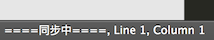

# Sublime 组件化开发插件

Sublime 组件化开发插件是糯米移动开放平台为组件开发者提供的一套开源的 Sublime Text 扩展插件，包括项目管理、同步调试、上传发布、代码补全、文档搜索等功能，为组件的开发 - 调试 - 发布环节提供方便。

## 1. 安装

### 1.1 通过 Package Control 安装

> TODO: 待官方审核通过插件

### 1.2 手工安装

1. `git clone --depth 1 http://gitlab.baidu.com/zhangyu38/ncop-sublime-plugin.git 'ncop'`

2. Sublime 顶部菜单 -> Sublime Text 2/3 -> Preferences -> Browse Packages，弹出 Packages 文件夹，将 `ncop` 文件夹置于此处

## 2. 配置

### 2.1 配置 token

1. 访问平台 [个人设置](http://developer.nuomi.com/#/personal/token)，复制 token

    

2. Sublime 顶部菜单 -> Sublime Text 2/3 -> Preferences -> Package Settings -> 组件化开发 -> `设置 token`，底部弹出输入框，粘贴 token 后回车确认

    

## 3 使用

### 3.1 调试功能

#### 3.1.1 新建项目

1. 将待建项目的文件夹拖至 Sublime 窗口，界面左侧出现该文件夹

2. 右键点击项目文件夹，选择`新建组件项目`
    
    

3. 底部弹出输入框，填入项目名称后回车确认
    
    

4. 稍等片刻，浏览器会自动打开在线调试工具页面，代表新项目创建成功

#### 3.1.2 项目同步

1. 右键点击项目文件夹，选择`开启同步`

2. 点击项目内任意文件，如果底部状态栏出现`同步中`字样，代表项目同步成功

    

3. 同步状态下，项目内任意文件的变动都会同步更新到线上

4. 若要停止同步，右键点击项目文件夹，选择`停止同步` 

> 在未使用`新建项目`功能的情况下，也可直接使用`开启同步`功能，此时会自动新建一个以该文件夹命名的项目。

#### 3.1.3 生成配置

1. 右键点击项目文件夹，选择`生成配置文件`

2. 底部弹出输入框，填入组件名称（**请确保该组件存在**），回车确认

3. 文件夹内将会创建一个 `config.json` 文件，该文件内容包含了自动生成的组件版本号和各页面信息

    

> 非调试项目的文件夹，也可使用该功能来生成配置文件。

#### 3.1.4 项目预览

##### 浏览器预览

1. 打开**同步中**项目里的任意文件，右键点击编辑区域 -> `浏览器预览`，或者快捷键 <kbd>Ctrl</kbd> + <kbd>Alt</kbd> + <kbd>B</kbd>（Mac 为：<kbd>Cmd</kbd> + <kbd>Alt</kbd> + <kbd>B</kbd>）

    

2.  在弹出的下拉菜单中选择页面名称，浏览器将会打开对应页面

    

##### 二维码预览

1. 打开**同步中**项目里的任意文件，右键点击编辑区域 -> `二维码预览`，或者快捷键 <kbd>Ctrl</kbd> + <kbd>Alt</kbd> + <kbd>R</kbd>（Mac 为：<kbd>Cmd</kbd> + <kbd>Alt</kbd> + <kbd>R</kbd>）

2.  在弹出的下拉菜单中选择页面名称，将会弹出对应页面的二维码

#### 3.1.5 删除项目

- 右键点击项目文件夹，选择`删除组件项目`

### 3.2 发布功能

#### 3.2.1 上传组件包

1. 右键点击含有 `config.json` 文件的文件夹，选择 `上传发布`

2. 上传成功后，浏览器会自动打开组件列表（测试环境）页面，方便进行后续操作

    

### 3.3 代码补全

- 在 JS 文件或 `<script>` 标签内，输入 `BNJS` 时会触发提示，选择需要的 API 选项完成代码补全

    

> **注意**：在 Sublime 里输入 `.` 会导致提示收起，可跳过 `.` 来避免这一情况。如 `BNJS.http` 输入为 `BNJShttp`。

### 3.4 文档搜索

1. 在编辑区域，右键点击需要查找的单词/变量（或者选中所需文本再右键点击），选择`搜索组件化文档`（快捷键：<kbd>Ctrl</kbd> + <kbd>Alt</kbd> + <kbd>S</kbd>，Mac：<kbd>Cmd</kbd> + <kbd>Alt</kbd> + <kbd>S</kbd>）

    

2. 在顶部弹出的搜索结果中选择文档，浏览器将会打开对应页面

    
